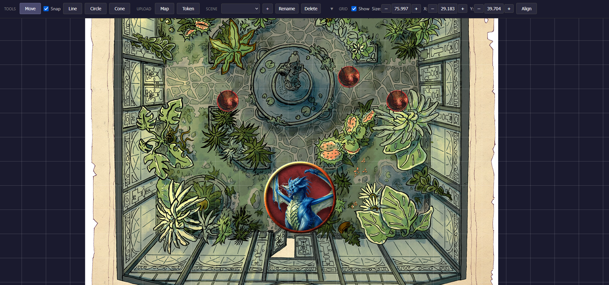

<p align="center" style="margin-bottom: 2em;">
  <a href="user-guide" style="display: inline-block; padding: 0.75em 1.5em; margin: 0.25em; background-color: #159957; color: white; text-decoration: none; border-radius: 0.5em; font-weight: bold;">User Guide</a>
  <a href="hosting" style="display: inline-block; padding: 0.75em 1.5em; margin: 0.25em; background-color: #159957; color: white; text-decoration: none; border-radius: 0.5em; font-weight: bold;">Hosting Guide</a>
</p>

# Simple VTT Documentation

Simple VTT is a lightweight Virtual Table Top application for tabletop RPG games. It runs in your browser and syncs in real-time across all connected players.



## Key Features

- **No Login Required** - Everyone can join and participate immediately
- **Real-time Sync** - All changes sync instantly via WebSocket
- **Multiple Scenes** - Create and switch between different maps and encounters
- **Measurement Tools** - Line, circle, and cone measurements visible to all players
- **Grid System** - Configurable grid with snap-to-grid and alignment tools

## Getting Started

- **[User Guide](user-guide)** - Learn how to use Simple VTT as a player or GM
- **[Hosting Guide](hosting)** - Instructions for running your own server

## Quick Start

If you just want to run the server locally:

```bash
git clone https://github.com/TomBen-org/simple-vtt.git
cd simple-vtt
npm install
npm run build
npm start
```

Then open [http://localhost:3000](http://localhost:3000) in your browser.
